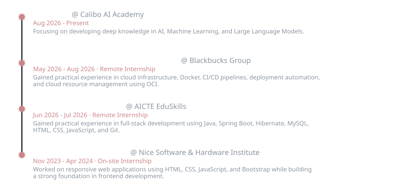

<div align="center">
<br>
<!-- Centered Name Heading -->
<h1 align="center">Hey there , I'm Mounika Rayapalli</h1>

<!-- Centered Subtitle with shirt theme color #cb8589 -->


<br>

<!-- Animated typing tag line (centered with reduced spacing to buttons) -->


<br>

<!-- Stable Fancy Buttons (underline-free & shadow-free) -->
<a href="https://mounika-rayapalli-portfolio.vercel.app/" target="_blank"></a>&nbsp;&nbsp;&nbsp;&nbsp;<a href="https://www.linkedin.com/in/rayapalli-mounika/" target="_blank"></a>&nbsp;&nbsp;&nbsp;&nbsp;<a href="mailto:rayapallymounika@gmail.com"></a>

</div>

<br>

### About Me

<div align="center">
  
</div>

<br>

<div align="center">
  
</div>

<br>

### Tech Stack & Skills

#### <font color="#cb8589">Artificial Intelligence & Machine Learning</font>
         

#### <font color="#cb8589">Programming</font>
 

#### <font color="#cb8589">Web Development</font>
     

#### <font color="#cb8589">Databases</font>
 

#### <font color="#cb8589">Tools & Platforms</font>
         

<br>

<div align="center">
  
</div>

<br>

### Featured Projects

#### <font color="#cb8589">Fashion Recommendation System</font>
An AI-powered recommendation application designed to understand user preferences and generate relevant fashion recommendations.  
*<font color="#b37579">Recommendation Systems</font> · <font color="#b37579">NLP</font> · <font color="#b37579">TF-IDF</font> · <font color="#b37579">Generative AI</font> · <font color="#b37579">Streamlit</font>*

<br>

#### <font color="#cb8589">Disease Detection System</font>
A computer-vision-based system designed to assist with disease detection from medical X-ray images.  
*<font color="#b37579">Deep Learning</font> · <font color="#b37579">TensorFlow</font> · <font color="#b37579">Computer Vision</font> · <font color="#b37579">Image Classification</font>*

<br>

#### <font color="#cb8589">TEKKEN-MOTION</font>
A gesture-controlled interaction system that uses hand movements to create real-time controls.  
*<font color="#b37579">MediaPipe</font> · <font color="#b37579">OpenCV</font> · <font color="#b37579">Computer Vision</font> · <font color="#b37579">Gesture Recognition</font>*

<br>

#### <font color="#cb8589">Kubernetes Cluster Deployment on AWS EKS</font>
A cloud-native deployment project demonstrating how containerized applications can be deployed and managed using Kubernetes on Amazon EKS.  
*<font color="#b37579">AWS</font> · <font color="#b37579">EKS</font> · <font color="#b37579">Kubernetes</font> · <font color="#b37579">EC2</font> · <font color="#b37579">ECR</font> · <font color="#b37579">IAM</font> · <font color="#b37579">Load Balancing</font>*

<br>

#### <font color="#cb8589">Infrastructure Deployment with Terraform</font>
Infrastructure-as-Code project focused on automating cloud infrastructure provisioning.  
*<font color="#b37579">Terraform</font> · <font color="#b37579">AWS</font> · <font color="#b37579">Infrastructure as Code</font> · <font color="#b37579">Automation</font>*

<br>

<div align="center">
  
</div>

<br>

### Work Experience

<div align="center">
  
</div>

<br>

### Certifications

#### --<font color="#cb8589">Hedera Certified Professional Suite</font>
*<font color="#b37579">The Hashgraph Association · 2026</font>*  
Developer Associate (HCDA), Foundation (HCF), and Business Foundation (HBF).
<br>

#### --<font color="#cb8589">Human Computer Interaction</font>
*<font color="#b37579">NPTEL (SWAYAM) · IIT Delhi · 2026</font>*  
Earned an Elite + Silver certification with a consolidated score of 83% from IIIT Delhi.
<br>

#### --<font color="#cb8589">Blockchain and its Applications</font>
*<font color="#b37579">NPTEL (SWAYAM) · IIT Kharagpur · 2026</font>*  
Completed the 12-week course covering blockchain models, smart contracts, and consensus.
<br>

#### --<font color="#cb8589">Oracle Cloud Foundations Associate</font>
*<font color="#b37579">Oracle University · 2025</font>*  
Gained knowledge of cloud concepts, OCI services, security, and pricing models.
<br>

#### --<font color="#cb8589">Artificial Intelligence Foundation Certification</font>
*<font color="#b37579">Infosys Springboard · 2025</font>*  
Acquired core AI concepts, learning models, and foundational artificial intelligence principles.
<br>

#### --<font color="#cb8589">Python Foundation</font>
*<font color="#b37579">Infosys Springboard · 2024</font>*  
Learned core Python programming, data handling, and object-oriented concepts.

<br>

<div align="center">
  
</div>

<br>

### GitHub Analytics & Insights

<div align="center">

<!-- Custom styled Stats and Languages to match shirt theme color #cb8589 (we'll work on these later)


-->

<br><br>


<br><br>

<!-- Contribution Activity Graph (we'll work on these later)

-->

</div>

<br>

<div align="center">
  
</div>

<br>

### What I Value

```text
Curiosity        → Keep learning
Problem Solving  → Understand before building
Consistency      → Improve every day
Collaboration    → Build better together
Practicality     → Turn knowledge into working solutions
```

<br>

<div align="center">
  
</div>

<br>

<div align="center">
<!-- Capsule Render waving footer with pink/plum colors -->

</div>
