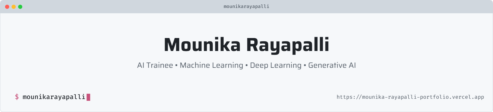

<picture>
  <source media="(prefers-color-scheme: dark)" srcset="art/header-dark.png">
  
</picture>


<!-- ========================================================= -->
<!--                    GITHUB PROFILE README                  -->
<!-- ========================================================= -->

<div align="center">

  <!-- Responsive Light/Dark Banner -->
  <picture>
    <source
      media="(prefers-color-scheme: dark)"
      srcset="https://capsule-render.vercel.app/api?type=waving&height=220&color=gradient&customColorList=12,14,16&text=Hey%20there%2C%20I'm%20Mounika%20Rayapalli&fontColor=ffffff&fontSize=42&fontAlignY=38&desc=AI%20Trainee%20%7C%20Machine%20Learning%20%7C%20Generative%20AI&descAlignY=60&descSize=18"
    />
    <source
      media="(prefers-color-scheme: light)"
      srcset="https://capsule-render.vercel.app/api?type=waving&height=220&color=gradient&customColorList=24,30,32&text=Hey%20there%2C%20I'm%20Mounika%20Rayapalli&fontColor=ffffff&fontSize=42&fontAlignY=38&desc=AI%20Trainee%20%7C%20Machine%20Learning%20%7C%20Generative%20AI&descAlignY=60&descSize=18"
    />
    
  </picture>

  <br>

  <!-- Animated Typing -->
  <a href="https://github.com/mounikarayapalli">
    
  </a>

  <br><br>

  <!-- GitHub Badges -->
  <a href="https://github.com/mounikarayapalli">
    
  </a>

  <a href="https://github.com/mounikarayapalli?tab=repositories">
    
  </a>

  

  <br><br>

  <a href="https://mounika-rayapalli-portfolio.vercel.app/">
    
  </a>

  <a href="https://www.linkedin.com/in/rayapalli-mounika/">
    
  </a>

</div>

<br>

<!-- ========================================================= -->
<!--                         ABOUT ME                           -->
<!-- ========================================================= -->

<h2 align="center">🌸 About Me</h2>

<table align="center" width="90%">
<tr>

<td width="65%" valign="top">

### Hey! I'm **Mounika Rayapalli** 👋

I'm a **Computer Science & Engineering student and AI Trainee at Calibo AI Academy**, focused on developing practical skills in **Artificial Intelligence and Machine Learning**.

- 🎓 Computer Science & Engineering student
- 🤖 AI Trainee at **Calibo AI Academy**
- 🧠 Exploring **Machine Learning, Deep Learning, Generative AI & LLMs**
- 🐍 Building projects with **Python**
- ☕ Working with **Java**
- 👁️ Exploring **Computer Vision & Image Classification**
- 📊 Interested in **Recommendation Systems & Intelligent Applications**
- 🌐 Developing interactive **Web Applications**
- ☁️ Exploring **Cloud Computing & DevOps**
- 📚 Strengthening my foundations in **DSA, SQL, Python & Java**
- 🚀 Passionate about turning ideas into **working solutions**
- 🌱 Continuously improving through **hands-on projects and experimentation**

> **Building intelligent solutions that turn ideas into practical applications.**

</td>

<td width="35%" align="center" valign="middle">


<br><br>


<br><br>


</td>

</tr>
</table>

<br>

<!-- ========================================================= -->
<!--                       AI FOCUS                             -->
<!-- ========================================================= -->

<h2 align="center">🧠 AI Focus Areas</h2>

<div align="center">


</div>

<br>

<!-- ========================================================= -->
<!--                       TECH STACK                          -->
<!-- ========================================================= -->

<h2 align="center">🛠️ Tech Stack</h2>

<div align="center">

### 🤖 Artificial Intelligence & Machine Learning


<br><br>


<br><br>

### 💻 Programming & Web Development


<br><br>


<br><br>

### 🗄️ Databases


<br><br>

### ☁️ Cloud, DevOps & Tools


<br><br>


</div>

<br>

<!-- ========================================================= -->
<!--                    FEATURED PROJECTS                       -->
<!-- ========================================================= -->

<h2 align="center">🚀 Featured Projects</h2>

<div align="center">

<table width="90%">

<tr>
<td width="50%" valign="top">

### 👗 Fashion Recommendation System

An AI-powered recommendation application designed to understand user preferences and generate relevant fashion recommendations.

**Focus:**  
Recommendation Systems · NLP · TF-IDF · Generative AI · Streamlit

</td>

<td width="50%" valign="top">

### 🩻 Disease Detection System

A computer-vision-based system designed to assist with disease detection from medical X-ray images.

**Focus:**  
Deep Learning · TensorFlow · Computer Vision · Image Classification

</td>
</tr>

<tr>
<td width="50%" valign="top">

### 🎮 TEKKEN-MOTION

A gesture-controlled interaction system that uses hand movements to create real-time controls.

**Focus:**  
MediaPipe · OpenCV · Computer Vision · Gesture Recognition

</td>

<td width="50%" valign="top">

### ☁️ Kubernetes Cluster Deployment on AWS EKS

A cloud-native deployment project demonstrating how containerized applications can be deployed and managed using Kubernetes on Amazon EKS.

**Focus:**  
AWS · EKS · Kubernetes · EC2 · ECR · IAM · Load Balancing

</td>
</tr>

<tr>
<td width="50%" valign="top">

### 🏗️ Infrastructure Deployment with Terraform

An Infrastructure-as-Code project focused on automating cloud infrastructure provisioning.

**Focus:**  
Terraform · AWS · Infrastructure as Code · Automation

</td>

<td width="50%" valign="top">

### 📦 AI Stock Manager

An AI-powered inventory management project focused on forecasting demand and recommending optimal inventory quantities.

**Focus:**  
Machine Learning · Forecasting · Explainable AI · Python

</td>
</tr>

</table>

</div>

<br>

<!-- ========================================================= -->
<!--                    PROJECT SHOWCASE                       -->
<!-- ========================================================= -->

<h2 align="center">💡 What I Build</h2>

<div align="center">

<table width="90%">
<tr>

<td align="center" width="33%">

### 🤖 AI Applications

Building practical applications powered by Machine Learning, Generative AI and LLMs.

</td>

<td align="center" width="33%">

### 👁️ Computer Vision

Exploring image classification, object detection, gesture recognition and visual intelligence.

</td>

<td align="center" width="33%">

### ☁️ Cloud & Automation

Exploring cloud infrastructure, containers, Kubernetes, Terraform and deployment automation.

</td>

</tr>
</table>

</div>

<br>

<!-- ========================================================= -->
<!--                    GITHUB ANALYTICS                       -->
<!-- ========================================================= -->

<h2 align="center">📊 GitHub Analytics</h2>

<div align="center">

<a href="https://github.com/mounikarayapalli">
  
</a>

<a href="https://github.com/mounikarayapalli">
  
</a>

</div>

<br>

<!-- ========================================================= -->
<!--                     GITHUB STREAK                         -->
<!-- ========================================================= -->

<h2 align="center">🔥 GitHub Streak</h2>

<div align="center">

<a href="https://github.com/mounikarayapalli">
  
</a>

</div>

<br>

<!-- ========================================================= -->
<!--                  ACTIVITY GRAPH                            -->
<!-- ========================================================= -->

<h2 align="center">📈 Contribution Activity</h2>

<div align="center">

<a href="https://github.com/mounikarayapalli">
  
</a>

</div>

<br>

<!-- ========================================================= -->
<!--                  CONTRIBUTION SNAKE                       -->
<!-- ========================================================= -->

<h2 align="center">🐍 Contribution Snake</h2>

<div align="center">

<!--
===============================================================
GitHub Action Setup
===============================================================

Create this file:

.github/workflows/snake.yml

Then add:

name: Generate Contribution Snake

on:
  schedule:
    - cron: "0 0 * * *"
  workflow_dispatch:

jobs:
  generate:
    runs-on: ubuntu-latest

    steps:
      - uses: Platane/snk@v3
        with:
          github_user_name: ${{ github.repository_owner }}
          outputs: |
            dist/github-contribution-grid-snake.svg
            dist/github-contribution-grid-snake-dark.svg?palette=pastel

      - uses: crazy-max/ghaction-github-pages@v4
        with:
          build_dir: dist
        env:
          GH_PAT: ${{ secrets.GITHUB_TOKEN }}

===============================================================
-->

<picture>
  <source
    media="(prefers-color-scheme: dark)"
    srcset="https://raw.githubusercontent.com/mounikarayapalli/mounikarayapalli/output/github-contribution-grid-snake-dark.svg"
  />
  <source
    media="(prefers-color-scheme: light)"
    srcset="https://raw.githubusercontent.com/mounikarayapalli/mounikarayapalli/output/github-contribution-grid-snake.svg"
  />
  
</picture>

</div>

<br>

<!-- ========================================================= -->
<!--                    CURRENTLY LEARNING                      -->
<!-- ========================================================= -->

<h2 align="center">📚 Currently Learning</h2>

<div align="center">

```text
Machine Learning
       ↓
Deep Learning
       ↓
Generative AI
       ↓
Large Language Models
       ↓
AI Application Development
