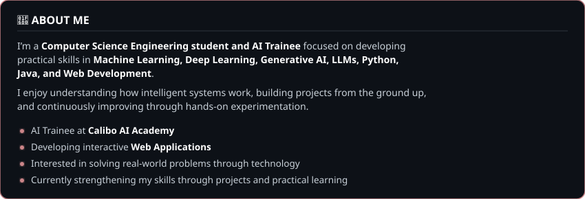
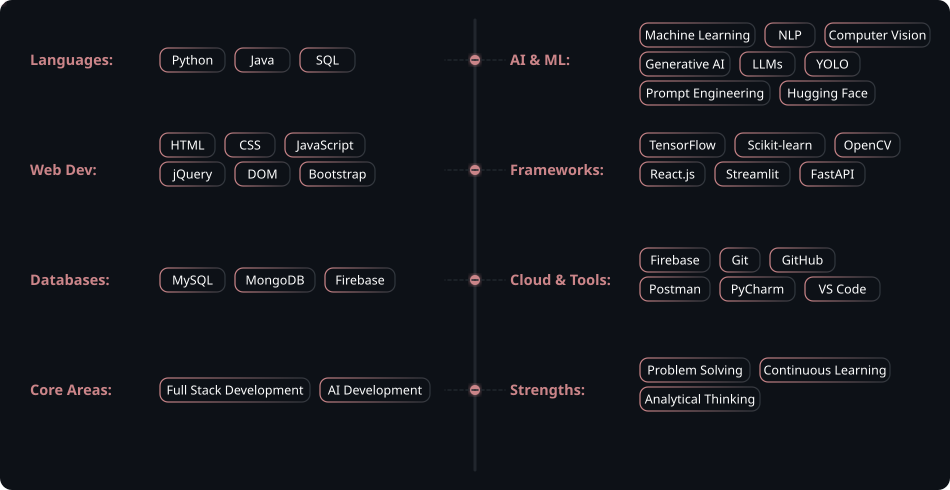

 
<!-- Centered Name Heading -->
<h1 align="center">Hey there , I'm Mounika Rayapalli</h1>

<!-- Centered Subtitle with shirt theme color #cb8589 -->

 

<!-- Animated typing tag line (centered with reduced spacing to buttons) -->

 

<!-- Stable Fancy Buttons (underline-free & shadow-free) -->
&nbsp;&nbsp;&nbsp;&nbsp;&nbsp;&nbsp;&nbsp;&nbsp;

 

  

 

  

 

## 🛠️ Tech Stack & Skills

  

 

  

 

## 📂 Featured Projects

<table>
  <tr>
    <td width="50%" valign="top">
      <h3>🧠 AI Medical Assistant</h3>
      
An intelligent healthcare assistant designed to assist with medical inquiries and preliminary symptom analysis using advanced NLP and ML models.

      AI · Machine Learning · Medical NLP · Diagnosis
        
      <a href="https://github.com/mounikarayapalli/AI-Medical-Assistant" target="_blank"><b>Repository →</b></a>
    </td>
    <td width="50%" valign="top">
      <h3>💼 Developer Portfolio</h3>
      
Personal developer portfolio website designed to showcase projects, technical skills, and internship history with a fully responsive layout.

      React · HTML · CSS · JavaScript
        
      <a href="https://github.com/mounikarayapalli/mounika-portfolio" target="_blank"><b>Repository →</b></a>
    </td>
  </tr>
  <tr>
    <td width="50%" valign="top">
      <h3>🎓 TECH-DESIRE</h3>
      
Interactive educational platform for software engineering trainees, offering dynamic study paths and automated quiz validations.

      HTML · CSS · JavaScript · Bootstrap
        
      <a href="https://github.com/mounikarayapalli/TECH-DESIRE" target="_blank"><b>Repository →</b></a>
    </td>
    <td width="50%" valign="top">
      <h3>🍽️ Restaurant Landing Page</h3>
      
A premium responsive restaurant landing page featuring interactive menus, booking showcases, and staff profiles.

      HTML · CSS · JavaScript · Responsive Design
        
      <a href="https://github.com/mounikarayapalli/restaurant-landing-page" target="_blank"><b>Repository →</b></a>
    </td>
  </tr>
</table>

 

  

 

## 💼 Work Experience

* **AI Trainee** @ Calibo AI Academy
  * *Focusing on developing deep knowledge in AI, ML, and LLMs.*
* **Cloud Infrastructure & DevOps Engineer Intern** @ BlackBucks Group
  * *Worked on infrastructure provisioning, container orchestration, and cloud architecture.*
* **Java Full Stack Developer Intern** @ AICTE EduSkills
  * *Designed and built web applications using Java stacks.*

 

## 🏆 Certifications

- 🐍 **Python Foundation Certification** – Infosys Springboard
- 💻 **C Programming** – Spoken Tutorial Project, IIT Bombay
- 🧠 **Introduction to Responsible AI** – Google Cloud Skills Boost
- 🚀 **Pragati: Path to Future Program** – Infosys Springboard

 

  

 

## 📊 GitHub Analytics & Insights

<!-- Custom styled Stats and Languages to match shirt theme color #cb8589 -->

  

  

 

  

 

## 🐍 Git Contribution Snake

 

<!-- Capsule Render waving footer with pink/plum colors -->

