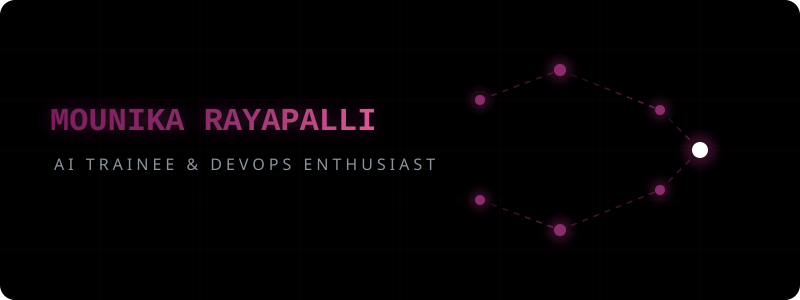

<!-- Custom Animated Banner -->

  

<!-- Typing SVG Intro -->

 

<!-- Social Badges with hover-like gradients -->

 

  

 

## 🚀 About Me

I'm a Computer Science Engineering student and AI Trainee focused on developing practical skills in Machine Learning, Deep Learning, Generative AI, LLMs, Python, Java, and Web Development.

* 💡 **What I do**: Build intelligent systems, deploy DevOps pipelines, and continuous learning.
* 🎓 **Education**: Computer Science Engineering Student.
* 🤖 **Current Training**: Calibo AI Academy.
* 💼 **Philosophy**: Hands-on, project-based learning — solve real problems and refine solutions dynamically.

 

  

 

## 🛠️ Tech Stack & Skills

| Category | Technologies |
| :--- | :--- |
| **AI / Machine Learning** |     |
| **Programming** |  |
| **Web Development** |  |
| **Databases** |  |
| **Cloud & DevOps** |  |
| **Tools & Platforms** |   |

 

  

 

## 📂 Featured Projects

<table>
  <tr>
    <td width="50%" valign="top">
      <h3>🤖 Fashion Recommendation System</h3>
      
AI-powered recommendation application using state-of-the-art architectures.

      NLP · TF-IDF · Generative AI · Streamlit
        
      <a href="https://github.com/mounikarayapalli"><b>Repository →</b></a>
    </td>
    <td width="50%" valign="top">
      <h3>👁️ Disease Detection System</h3>
      
Computer-vision-based disease detection from medical X-ray imaging.

      Deep Learning · TensorFlow · Computer Vision · Image Classification
        
      <a href="https://github.com/mounikarayapalli"><b>Repository →</b></a>
    </td>
  </tr>
  <tr>
    <td width="50%" valign="top">
      <h3>🎮 TEKKEN-MOTION</h3>
      
Gesture-controlled gaming interaction system via webcam detection.

      MediaPipe · OpenCV · Computer Vision · Gesture Recognition
        
      <a href="https://github.com/mounikarayapalli"><b>Repository →</b></a>
    </td>
    <td width="50%" valign="top">
      <h3>☁️ Kubernetes AWS EKS</h3>
      
Automated Kubernetes cluster deployment with load balancing on AWS.

      AWS · EKS · Kubernetes · EC2 · Load Balancing
        
      <a href="https://github.com/mounikarayapalli"><b>Repository →</b></a>
    </td>
  </tr>
</table>

 

  

 

## 💼 Work Experience

* **AI Trainee** @ Calibo AI Academy
  * *Focusing on developing deep knowledge in AI, ML, and LLMs.*
* **Cloud Infrastructure & DevOps Engineer Intern** @ BlackBucks Group
  * *Worked on infrastructure provisioning, container orchestration, and cloud architecture.*
* **Java Full Stack Developer Intern** @ AICTE EduSkills
  * *Designed and built web applications using Java stacks.*

 

## 🏆 Certifications

- 🐍 **Python Foundation Certification** – Infosys Springboard
- 💻 **C Programming** – Spoken Tutorial Project, IIT Bombay
- 🧠 **Introduction to Responsible AI** – Google Cloud Skills Boost
- 🚀 **Pragati: Path to Future Program** – Infosys Springboard

 

  

 

## 📊 GitHub Analytics & Insights

<!-- Custom styled Stats and Languages to match pink/purple theme -->

  

  

 

  

 

## 🐍 Git Contribution Snake

 

<!-- Capsule Render waving footer -->

