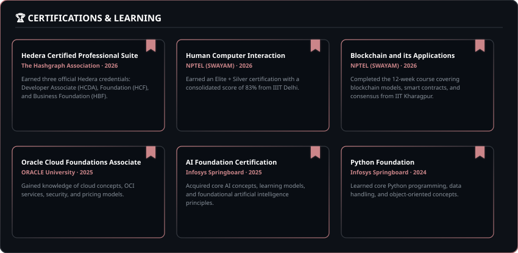

 
<!-- Centered Name Heading -->
<h1 align="center">Hey there , I'm Mounika Rayapalli</h1>

<!-- Centered Subtitle with shirt theme color #cb8589 -->

 

<!-- Animated typing tag line (centered with reduced spacing to buttons) -->

 

<!-- Stable Fancy Buttons (underline-free & shadow-free) -->
&nbsp;&nbsp;&nbsp;&nbsp;&nbsp;&nbsp;&nbsp;&nbsp;

 

  

 

  

 

## 🛠️ Tech Stack & Skills

  

 

  

 

## 📂 Featured Projects

> ### 🧠 [AI Medical Assistant](https://github.com/mounikarayapalli/AI-Medical-Assistant)
> An intelligent healthcare assistant designed to assist with medical inquiries and symptom analysis using advanced NLP and ML models.
>
> `AI` · `Machine Learning` · `Medical NLP` · `Diagnosis`
>
> 📂 **[View Repository →](https://github.com/mounikarayapalli/AI-Medical-Assistant)**

 

> ### 💼 [Developer Portfolio](https://github.com/mounikarayapalli/mounika-portfolio)
> Personal developer portfolio website designed to showcase projects, technical skills, and internship history with a responsive layout.
>
> `React` · `HTML` · `CSS` · `JavaScript`
>
> 📂 **[View Repository →](https://github.com/mounikarayapalli/mounika-portfolio)**

 

> ### 🎓 [TECH-DESIRE](https://github.com/mounikarayapalli/TECH-DESIRE)
> Interactive educational platform for software engineering trainees, offering dynamic study paths and automated quiz validations.
>
> `HTML` · `CSS` · `JavaScript` · `Bootstrap`
>
> 📂 **[View Repository →](https://github.com/mounikarayapalli/TECH-DESIRE)**

 

> ### 🍽️ [Restaurant Landing Page](https://github.com/mounikarayapalli/restaurant-landing-page)
> A premium responsive restaurant landing page featuring interactive menus, booking showcases, and staff profiles.
>
> `HTML` · `CSS` · `JavaScript` · `Responsive Design`
>
> 📂 **[View Repository →](https://github.com/mounikarayapalli/restaurant-landing-page)**

 

  

 

### 💼 Work Experience

  

 

## 🏆 Certifications

  

 

  

 

## 📊 GitHub Analytics & Insights

<!-- Custom styled Stats and Languages to match shirt theme color #cb8589 -->

  

  

 

  

 

## 🐍 Git Contribution Snake

 

<!-- Capsule Render waving footer with pink/plum colors -->

